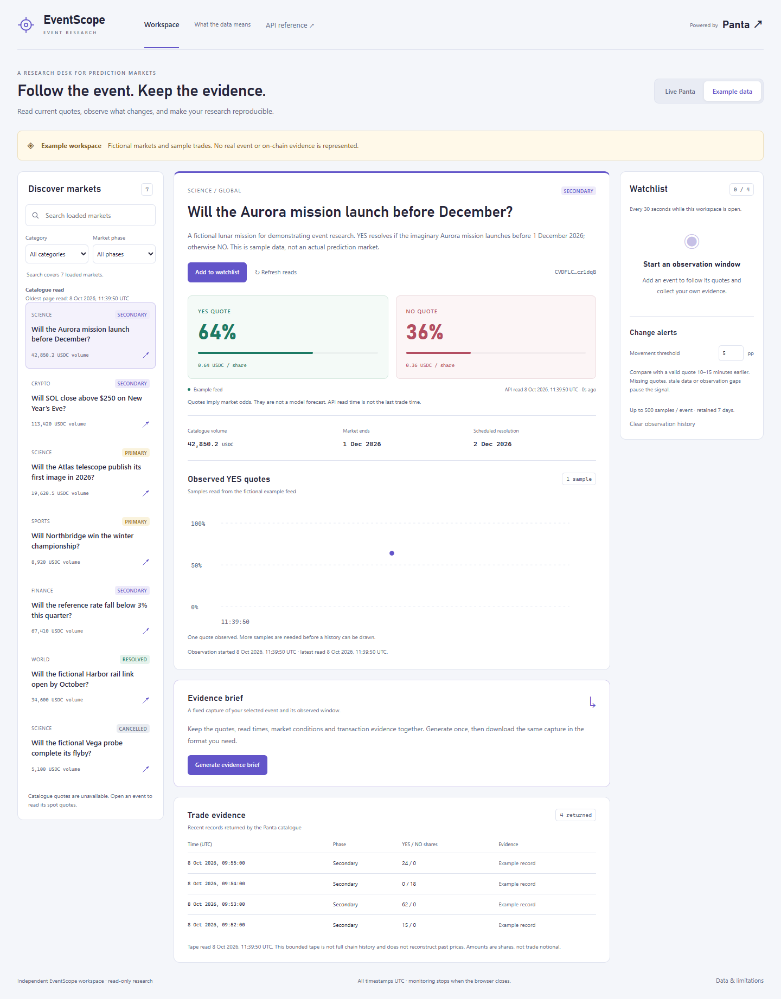

# EventScope

**Follow the event. Keep the evidence.** An independent prediction-market research workspace powered by Panta.

[English prototype walkthrough — downloadable WebM, 2:18](https://raw.githubusercontent.com/SylvanasW1ndrunner/panta-eventscope/main/docs/demo/prototype.webm) · [Screenshots and exported examples](docs/demo/README.md) · [Delivery status](docs/submission/status.json)

EventScope turns market discovery into a reproducible research workflow: open an event, observe actual detail quotes, compare watched events, and capture a timestamped evidence brief. It makes the difference between a missing price, a cached read and an observed change visible.

## Run locally

Requires Node.js 24+ and npm. No wallet, paid model service or transaction is required.

```sh
npm ci
npm run dev
```

Open [the local workspace](http://127.0.0.1:3000). Without a Panta key, live mode shows setup instructions. Select **Example data**, or open [the fictional example workspace](http://127.0.0.1:3000/?mode=demo). Example content is always labelled and never replaces a failed live read.

On Windows PowerShell, use `npm.cmd` if execution policy blocks `npm.ps1`.

For a production build:

```sh
npm run build
npm run start
```

The default commands bind to loopback. For a server or container deployment, set `PANTA_API_KEY` in the hosting environment and run `npm run start -- --hostname 0.0.0.0`. The homepage opens in Live Panta mode; a configured key is the only application requirement for live reads. Panta determines account access and rate limits, which the reader reports and respects.

## Connect legitimate Panta developer access

1. Obtain your own Panta developer API key. Superteam Google sign-in is a separate account. In the official documentation playground, [register](https://docs.panta.market/api-reference/auth/register) or [log in](https://docs.panta.market/api-reference/auth/token), copy the returned `access`, then use it as Bearer authentication on [Create API key](https://docs.panta.market/api-reference/account/create-key). Select `env=live` for actual market reads, use a descriptive name such as EventScope, and leave `revokeOthers=false`. Save the one-time `secret` privately. See the [official authentication flow](https://docs.panta.market/guides/authentication).
2. In our verification, a test key authenticated on the production API host but returned an explicitly labelled sandbox fixture with a non-mainnet market ID. Use a live key for actual market reads.
3. Copy `.env.example` to `.env.local`, which is ignored by Git, and set `PANTA_API_KEY`. On a hosting platform, set the same server environment variable instead. No additional access or quota confirmation setting is required.
4. Restart the server and open the homepage; **Live Panta** is the default.
5. Run the read-only verification command:

```sh
npm run verify:live
```

The verifier uses the same reader and parsers as the app. It requests categories, one catalogue page, one market detail and that market's bounded trade tape. A dated, secret-free summary is written under ignored `outputs/live-verification/`. Missing credentials, empty markets and provider errors remain explicit. A successful response-contract check with null quotes does not prove successful price observation.

**Do not put the key in chat, a URL, screenshots, browser storage or any `NEXT_PUBLIC_` variable.** No browser credential input is used. No registration, market creation, position, trade-building, signing or claim endpoints are called.

## Research workflow

- Discover by category and market phase. Search covers the **loaded catalogue**; cursor pagination expands that coverage. List prices are not detail prices.
- Open an event for YES/NO quotes, market conditions, catalogue volume, scheduled dates and its actual API read time.
- Missing titles get an explicit placeholder and abbreviated market ID. Catalogue volume retains the catalogue's own read time even if a detail response has no valuation.
- Watch up to **four** events while the browser is open; compare up to **three**. Active and watched details refresh every 30 seconds.
- History contains actual detail-read samples, not reconstructed trade prices. One sample stays one sample. Missing quotes, phase changes and gaps over 90 seconds break the curve.
- Default alerts require a movement of **5 percentage points** against the closest valid quote 10–15 minutes earlier, in the same uninterrupted phase. The threshold is adjustable from 1–20 pp. A quote older than 60 seconds cannot trigger. Sustained crossings are deduplicated until the condition resets.
- Generate an **Evidence Brief** to fix one market, source mode, read time, observation window and bounded transaction evidence. Markdown, JSON and CSV downloads use that same capture. CSV text is protected against spreadsheet formula injection; Markdown text is escaped.

History remains in this browser: up to 500 samples per event and seven days, with separate live/example storage. Corrupt or unavailable storage leaves an in-memory workspace with a visible notice. Monitoring stops when the browser closes. Clear observation history using the watchlist control.

## Data interpretation

Quotes may be interpreted as market-implied odds, not a model forecast. The app preserves independently returned YES/NO quotes rather than normalising them to sum to one. An unavailable quote is never rendered as zero.

`volumeUsdc` is **catalogue volume**; Panta does not specify a 24-hour window in this field. Trade amounts are shares, not trade notional. The returned trade tape is a bounded set of catalogue records, not all on-chain history. Format-valid live transaction signatures link to Solscan, without claiming explorer verification; fictional records never get explorer links.

API read time is when the EventScope server received the response, not Panta's internal update time or the latest trade timestamp. Cached reads keep their original time. Failed refreshes retain the previous result with a stale marker.

Authenticated production checks have verified all four response contracts, including available detail quotes and returned trade records. The live feed also returned null valuations and intermittent timeouts. These are preserved as missing or stale data. Catalogue quotes can be populated; they are not substituted for detail observations. See [dated integration evidence](docs/submission/live-integration.md) for the measured checks and limitations.

## API and architecture

| Panta GET resource | EventScope use | Cache |
| --- | --- | --- |
| `/categories/` | Discovery filter | 60 s |
| `/markets/` | Catalogue, phase filters, cursor pagination | 60 s |
| `/markets/{marketId}/` | Detail quotes and observations | 15 s |
| `/markets/{marketId}/trades/` | Bounded evidence tape | 30 s |

All live reads use the fixed production origin `https://live-api.panta.market/api/v1/`. Queries and 32-byte base58 market IDs are validated. Eight-second timeouts, rejected redirects, bounded payloads, identical-request coalescing, a two-request upstream concurrency cap and `Retry-After` pauses protect the integration. Error responses never forward raw upstream bodies or credentials. The key-bearing module is marked `server-only`.

`src/server/panta` owns upstream reads. Market parsing and exact Decimal.js calculations are shared pure functions. `src/features/observations` owns snapshots, phase/gap continuity, alerts and versioned storage. `src/features/briefs` captures and exports evidence. The Next.js interface adapts to desktop and narrow screens, with keyboard controls and visible focus.

## Verify

```sh
npm test
npm run typecheck
npm run build
npx playwright install chromium
npm run test:e2e
```

Unit tests replace only the external HTTP boundary. Browser tests use a local server with no Panta credentials; synthetic inputs are test fixtures, not live integration evidence. Tests cover parsing, exact thresholds, gaps, caching, rate limiting, request races, storage, exports, safe text, source isolation, keyboard use and 390px flows.

## Entry status and materials

See [the actual delivery status](docs/submission/status.json), [requirements and evidence](docs/submission/requirements.md), [Panta entry draft](docs/submission/panta-application.md), [Colosseum entry draft](docs/submission/colosseum-application.md), and [English demo script](docs/submission/demo-script.md).

Application drafts are entry preparations. Actual API checks are documented separately; there are no completed platform submissions, external users or revenue claims. Panta requires both the Colosseum main entry and the Superteam sidetrack entry. Winning is decided by the organisers.

See the [prototype screenshots, recorded walkthrough and actual exported examples](docs/demo/README.md). The 2-minute-18-second video has English captions and uses a visibly fictional source; authenticated production verification is recorded separately. The [independent review and verified fix pass](docs/submission/code-review.md) records the six functional issues addressed and the remaining external gates.



## Authorship and licences

EventScope product code, examples and presentation were independently authored with AI assistance. No source from the Panta playground was copied. Runtime briefs use deterministic rules; no language model or news service is connected. AI assistance should be disclosed wherever an entry form requests it.

Original project contributions are licensed under MIT. Dependencies retain their own licences: Next.js, React, Decimal.js, bs58, Vitest and tsx use MIT; TypeScript and Playwright use Apache-2.0. See the pinned lockfile and installed dependency notices.

Panta supplies live market data when authorised. **Powered by Panta** is linked in the interface. EventScope is an independent application and does not claim an official partnership.
